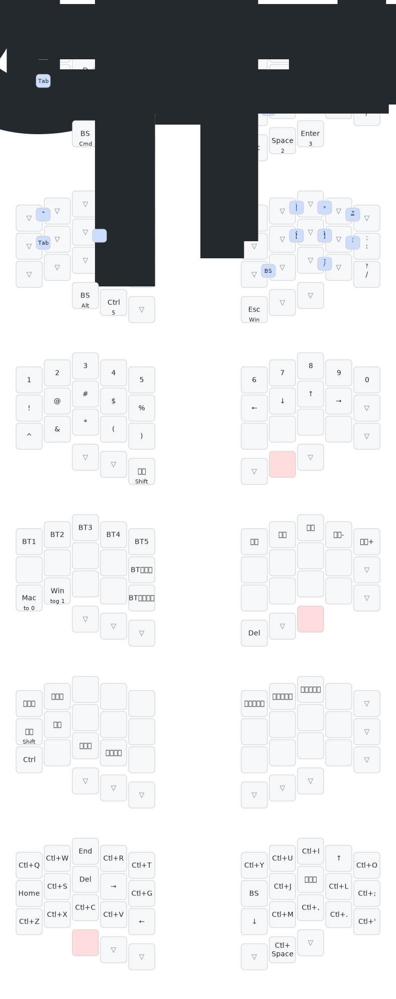

# KobitoKey_QWERTY

## Keymap

### レイヤー概要
- **Mac**: Mac用QWERTYレイヤー（:ホールド: Cmd+Shift、Cmdタップ: BS）
- **Win/Linux**: Windows/Linux用オーバーレイ（Macレイヤーとの差分のみ、トグル切替）
- **数字**: 数字・記号・矢印キー
- **設定**: Bluetooth・メディアコントロール
- **マウス**: オートマウスレイヤー（トラックボール操作時に自動切替）
- **Emacs**: Windows/Linux用Emacsキーバインド
- **Neovim**: Neovimモード（Ctrl押下時にEmacsレイヤーを無効化、S+Dトグル）

### コンボ
| キー | 出力 |
|------|------|
| Q+W | \` ~ |
| D+F | Cmd+Opt (Mac) / Ctrl+Alt (Win/Linux) |
| U+I | \| \\ |
| I+O | - _ |
| O+P | = + |
| A+S | Tab |
| J+K | [ { |
| K+L | ] } |
| L+: | ' " |
| ,+. | / ? |
| S+D | Neovimモード トグル (Winのみ) |
| N+M | BS |
